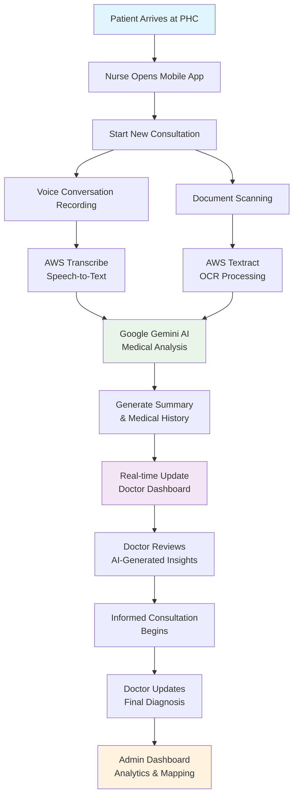

# Swasya AI
## Turning dialogue into data and data into clarity.

---

## **Project Title:** Swasya AI

### *Reimagining Primary Healthcare with Intelligence and Speed*

## **Problem Statement**

Primary healthcare systems in India are **overburdened and inefficient**, resulting in:

* **Delays in diagnosis** due to manual record handling and high doctor workload.
* **Miscommunication** between nurses, patients, and doctors.
* **Lack of structured patient history**, which slows down diagnosis and leads to repeated questions or errors.

There is a strong need for a **seamless, AI-driven workflow** that collects patient information before consultation, helping doctors make faster, data-backed decisions.

---

## **Proposed Solution — Swasya AI**

**Swasya AI** is an **AI-powered healthcare assistance system** designed for **primary health centers (PHCs)** to streamline communication and data flow between **nurses, doctors, and administrators**.
It reduces diagnosis time, ensures accurate record-keeping, and empowers doctors with **AI-generated insights** before they even meet the patient.

---

## **Tech Stack**

### **Frontend & Mobile**
- **React.js** with **Vite** - Modern web dashboard for doctors
- **Flutter** - Cross-platform mobile app for nurses
- **TailwindCSS** - Responsive and modern UI styling
- **React Router** - Client-side routing
- **Leaflet** - Interactive maps for health analytics

### **Backend & APIs**
- **Node.js** with **Express.js** - Primary API server
- **FastAPI** with **Python** - AI processing and ML services
- **AWS Lambda** - Serverless functions for scalability
- **AWS API Gateway** - RESTful API management

### **Databases & Storage**
- **MongoDB** - Primary database for patient records
- **AWS DynamoDB** - Serverless NoSQL database
- **AWS S3** - File storage for audio/image uploads

### **AI & Machine Learning**
- **Google Gemini AI** - Advanced language processing and medical analysis
- **AWS Transcribe** - Speech-to-text conversion
- **AWS Textract** - OCR and document analysis
- **Groq** - Fast inference for real-time AI responses

### **DevOps & Deployment**
- **AWS SAM (Serverless Application Model)** - Lambda deployment and infrastructure management
- **Docker** - Backend containerization
- **Vercel** - Frontend deployment

**[View Detailed AWS Infrastructure Documentation](./docs/AWS_INFRASTRUCTURE.md)** - Complete architecture, service stack, and deployment workflows

---

## **User Roles & Responsibilities**

### **Doctor**

* Uses the **web dashboard** to monitor live patient updates.
* Views **AI-transcribed summaries** of nurse-patient conversations in real time.
* **Accesses the AI-generated medical history**, created automatically from scanned documents and prescriptions, **before the consultation begins**.
* Tracks **regional health patterns** through live outbreak maps.

---

### **Nurse**

* Uses the **mobile application** to manage patient queues and initiate consultations.
* Starts a **voice conversation** with the patient in Hindi, English, or regional languages.
* **Scans patient documents and prescriptions** for automatic data extraction.
* The system transcribes and summarizes the interaction in real-time for the doctor's dashboard.

---

### **Healthcare Administrator**

* Manages the overall ecosystem: **doctors, nurses, and patient data**.
* Monitors **PHC performance**, workload, and outbreak trends.
* Maintains data access control and system-level analytics.

---

### **Patient**

* Interacts only with the **nurse**.
* Benefits from **faster consultations, structured medical history,** and **improved communication** between healthcare staff.

---

## **System Flow**

### **Detailed Workflow**

1. A **patient visits** a Primary Health Center.
2. The **nurse** opens the queue on their mobile app and starts a new consultation.
3. The **AI listens and transcribes** the nurse-patient conversation, extracting medical details and generating a summary.
4. The nurse **scans existing prescriptions or medical reports**, and AI builds an **organized digital medical history**.
5. On the **doctor's dashboard**, before the consultation:

   * The **AI-generated medical history** is displayed.
   * The **live transcription and summarized condition** are visible.
6. The doctor proceeds with the consultation, already informed about the patient's background, saving time and improving accuracy.
7. The **administrator dashboard** provides a higher-level view of all PHCs, users, and outbreak maps.

---

## **Core Features (with Names)**

### **1. Swasya Listen — AI Transcription & Summarization**

An intelligent speech module that:

* Converts multi-language (Hindi, English, regional) speech to text in real-time.
* Extracts key medical information using NLP.
* Generates a one-line summary of the patient's condition for the doctor.

**Goal:** Enable the doctor to know the patient's concern even before the conversation begins.

---

### **2. Swasya Scan — Document Scanning & AI Medical History**

A document intelligence module that:

* Scans prescriptions, test reports, and old documents.
* Uses OCR and AI to **generate a structured medical history** and timeline for the patient.
* Automatically links all records with the patient's unique ID (UHID).

**Goal:** Provide the doctor with complete context about the patient's background and ongoing treatments.

---

### **3. Swasya Sync — Real-Time Doctor Dashboard**

A web-based live dashboard that:

* Shows **transcriptions, summaries, and AI-generated medical history** in real time.
* Displays the current **patient queue and previous visit records**.
* Allows doctors to **annotate or update** findings instantly.

**Goal:** Syncs the nurse's mobile activity and doctor's view seamlessly for faster diagnosis.

---

### **4. Swasya Map — Regional Health Outbreak Visualization**

An analytics and visualization module that:

* Tracks regional cases and identifies **hotspots** based on symptoms or disease categories.
* Doctors view **local-level maps** (e.g., Jalandhar), while administrators view **state-level maps** (e.g., Punjab).
* Highlights spikes such as *"15 fever cases in one locality"* to assist in preventive action.

**Goal:** Enable proactive health management through AI-driven mapping.

---

## **Architecture Overview**

| Component        | Platform                                 | Description                                                  |
| ---------------- | ---------------------------------------- | ------------------------------------------------------------ |
| Nurse Interface  | **Flutter Mobile App**                   | For transcription, scanning, and patient management          |
| Doctor Interface | **React.js Web Dashboard**               | For live AI updates and medical records                      |
| Admin Interface  | **React.js Admin Panel**                 | For supervision, analytics, and map insights                 |
| AI Engine        | **Google Gemini + AWS Transcribe**       | For transcription, summarization, and information extraction |
| Database         | **MongoDB + AWS DynamoDB**               | Stores patient data and interaction logs                     |
| Backend          | **Node.js + AWS Lambda + FastAPI**       | API, authentication, and synchronization layer               |
| File Storage     | **AWS S3**                               | Audio recordings and document images                         |

---

## **Impact**

* **40% reduction** in diagnosis preparation time.
* **AI-assisted decision-making** for better accuracy.
* **Streamlined communication** between nurse and doctor.
* **Digitized medical history** for every rural patient.
* **Data-driven public health monitoring** for local authorities.

## **Future Scope**

* Integration with **ABHA / Ayushman Bharat digital health records**.
* Addition of **regional language support** for better accessibility.
* **Predictive analytics** to detect emerging disease patterns.
* Offline-first operation for **low-connectivity rural regions**.

---

> Built with passion by Team TechThugs for HackCBS 8.0 Hackathon
