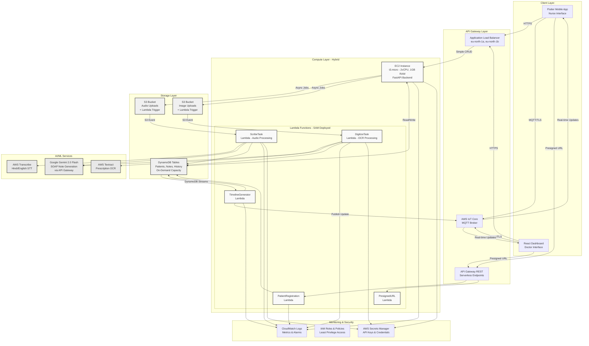
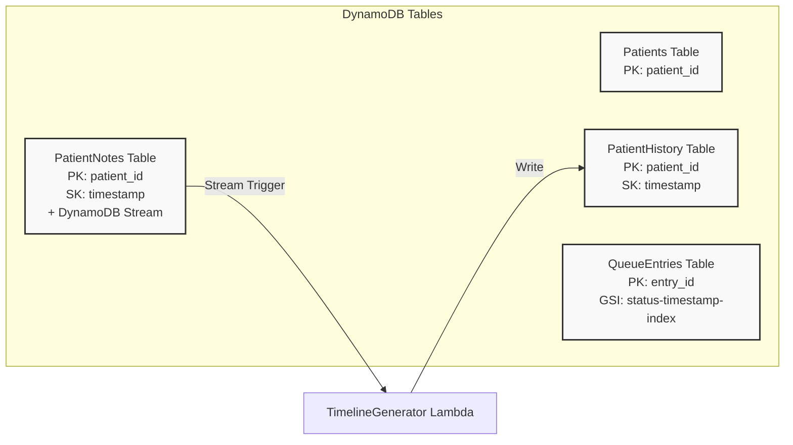
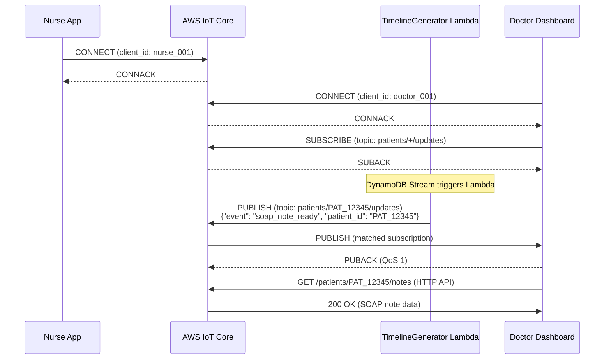
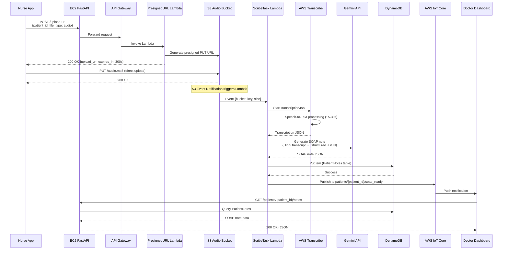
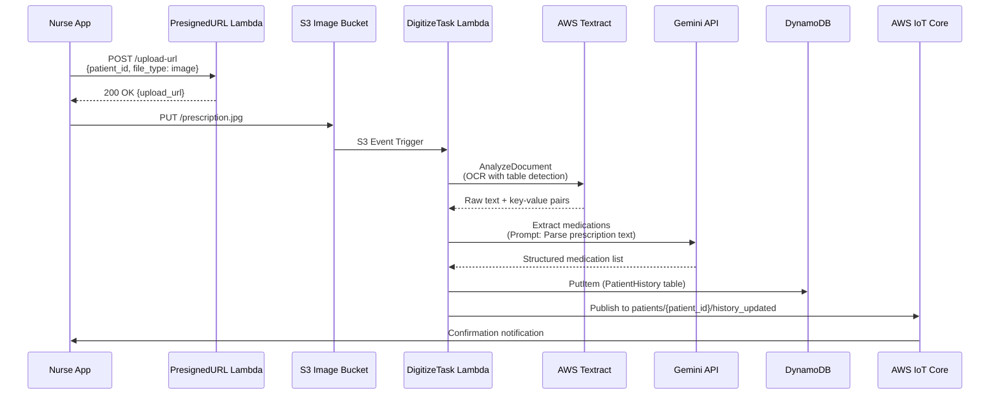
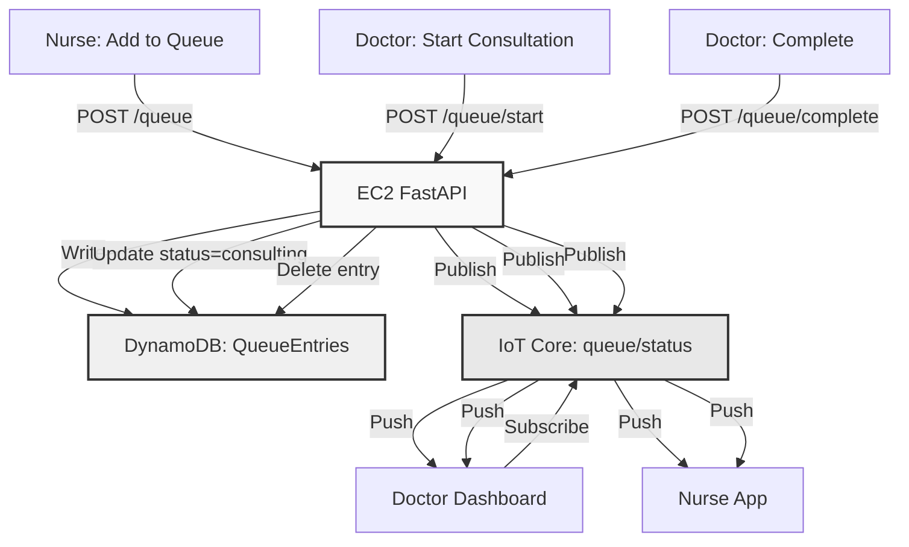

# AWS Infrastructure Architecture

## Swasya AI - Hybrid Cloud Architecture
**Turning dialogue into data and data into clarity**

### Executive Summary

Swasya AI leverages a **hybrid serverless architecture** on AWS, combining the cost-effectiveness of EC2 for high-frequency, low-latency endpoints with the scalability and event-driven capabilities of AWS Lambda for compute-intensive AI processing tasks. This approach optimizes for both performance and cost while maintaining enterprise-grade reliability.

**Key Architectural Decisions:**
- **EC2 (t3.micro)** for REST API endpoints requiring sub-200ms response times
- **AWS Lambda + SAM** for event-driven, auto-scaling AI workloads
- **DynamoDB** for serverless, single-digit millisecond data access
- **AWS IoT Core (MQTT)** for real-time bidirectional communication
- **S3 + Lambda Triggers** for asynchronous document/audio processing pipelines

---

## High-Level Architecture Overview



---

## Architectural Principles

### 1. Hybrid Compute Strategy

| Component | EC2 | Lambda | Rationale |
|-----------|-----|--------|-----------|
| **Patient Registration** | Yes | Yes (Backup) | High-frequency endpoint, needs <100ms latency |
| **Queue Management** | Yes | No | Real-time updates, WebSocket/MQTT integration |
| **SOAP Note Generation** | No | Yes | CPU-intensive, variable duration (10-30s) |
| **Document OCR** | No | Yes | Bursty traffic, unpredictable load |
| **Presigned URL Generation** | Yes | Yes | Stateless, can leverage Lambda cold start optimization |
| **Timeline RAG** | No | Yes | Memory-intensive, embeddings generation |

### 2. Event-Driven Processing

All heavy AI workloads are **decoupled** using S3 triggers:
- **Upload → Process → Store → Notify** pattern
- Eliminates timeouts for long-running tasks
- Automatic retries with exponential backoff
- Dead Letter Queue (DLQ) for failed jobs

### 3. Real-Time Communication

AWS IoT Core provides:
- **Persistent connections** (no polling overhead)
- **Publish/Subscribe** model for scalable fan-out
- **TLS 1.2** encrypted channels
- **QoS 1** (at-least-once delivery guarantee)

---

## AWS Service Stack

### Compute

#### 1. EC2 Instance (Primary API Server)

**Instance Type:** `t3.micro`

**Configuration:**
```yaml
Region: eu-north-1
Availability Zone: eu-north-1a
AMI: Ubuntu 22.04 LTS
API Endpoint: https://api.swasya.rishia.in
Security Group:
  - Port 80 (HTTP) → ALB only
  - Port 443 (HTTPS) → ALB only
  - Port 22 (SSH) → Bastion host only
IAM Role: EC2-Swasya-Backend-Role
  Policies:
    - DynamoDBFullAccess (scoped to Swasya tables)
    - S3PutObject (swasya-audio-uploads, swasya-image-uploads)
    - CloudWatchAgentServerPolicy
```


#### 2. AWS Lambda Functions

Deployed using **AWS SAM (Serverless Application Model)**

**SAM Template:** `backend/template.yaml`

| Function | Memory | Timeout | Trigger | Concurrency |
|----------|--------|---------|---------|-------------|
| `PatientRegistrationFunction` | 512 MB | 10s | API Gateway | 100 |
| `PresignedURLFunction` | 256 MB | 5s | API Gateway | 100 |
| `ScribeTaskFunction` | 2048 MB | 900s | S3 Event | 10 |
| `DigitizeTaskFunction` | 1024 MB | 300s | S3 Event | 10 |
| `TimelineGeneratorFunction` | 3008 MB | 300s | DynamoDB Stream | 5 |

**Environment Variables (via Secrets Manager):**
```bash
GEMINI_API_KEY → SecretId: prod/gemini/api-key
REGION → eu-north-1
PATIENTS_TABLE → Patients
NOTES_TABLE → PatientNotes
HISTORY_TABLE → PatientHistory
```

**Lambda Layers:**
- `boto3-layer` (AWS SDK)
- `google-genai-layer` (Gemini client)
- `numpy-pandas-layer` (for timeline embeddings)

---

### Storage

#### 1. Amazon DynamoDB

**Table Architecture:**



**Table: Patients**
```json
{
  "TableName": "Patients",
  "KeySchema": [
    { "AttributeName": "patient_id", "KeyType": "HASH" }
  ],
  "BillingMode": "PAY_PER_REQUEST",
  "PointInTimeRecoveryEnabled": true,
  "StreamEnabled": false
}
```

**Table: PatientNotes**
```json
{
  "TableName": "PatientNotes",
  "KeySchema": [
    { "AttributeName": "patient_id", "KeyType": "HASH" },
    { "AttributeName": "timestamp", "KeyType": "RANGE" }
  ],
  "BillingMode": "PAY_PER_REQUEST",
  "StreamSpecification": {
    "StreamEnabled": true,
    "StreamViewType": "NEW_IMAGE"
  },
  "GlobalSecondaryIndexes": [
    {
      "IndexName": "status-timestamp-index",
      "KeySchema": [
        { "AttributeName": "status", "KeyType": "HASH" },
        { "AttributeName": "timestamp", "KeyType": "RANGE" }
      ],
      "Projection": { "ProjectionType": "ALL" }
    }
  ]
}
```

**Why DynamoDB?**
- Single-digit millisecond latency at any scale
- No database server management
- Automatic scaling
- Built-in encryption at rest (AWS KMS)
- DynamoDB Streams for CDC (Change Data Capture)

#### 2. Amazon S3

**Bucket: swasya-audio-uploads-1762597760**
```yaml
Purpose: Audio recordings storage
Region: eu-north-1
Versioning: Enabled
Encryption: AES-256 (SSE-S3)
Lifecycle Policy:
  - Move to S3 Intelligent-Tiering after 30 days
  - Delete after 1 year (compliance)
Event Notifications:
  - Event: s3:ObjectCreated:*
  - Destination: ScribeTaskFunction (Lambda)
  - Filter: Suffix .mp3, .wav, .m4a
CORS Configuration:
  - AllowedOrigins: ["https://swasya.rishia.in"]
  - AllowedMethods: [PUT, POST]
  - AllowedHeaders: ["*"]
```

**Bucket: swasya-image-uploads-1762597760**
```yaml
Purpose: Prescription scans storage
Region: eu-north-1
Versioning: Enabled
Encryption: AES-256
Event Notifications:
  - Event: s3:ObjectCreated:*
  - Destination: DigitizeTaskFunction (Lambda)
  - Filter: Suffix .jpg, .png, .pdf
```

**S3 Presigned URLs:**
- Generated by `PresignedURLFunction` Lambda
- Expiration: 300 seconds (5 minutes)
- Allows direct upload from mobile app (no backend proxy)
- Automatic trigger on `CompleteMultipartUpload`

---

### AI/ML Services

#### 1. AWS Transcribe

**Service:** Amazon Transcribe Medical (specialized for healthcare)

**Configuration:**
```python
transcribe_client = boto3.client('transcribe', region_name='eu-north-1')

job_name = f"scribe-{patient_id}-{timestamp}"
transcribe_client.start_transcription_job(
    TranscriptionJobName=job_name,
    Media={'MediaFileUri': f"s3://{bucket}/{key}"},
    MediaFormat='mp3',
    LanguageCode='hi-IN',  # Hindi
    Settings={
        'ShowSpeakerLabels': True,
        'MaxSpeakerLabels': 2,  # Nurse + Patient
        'ChannelIdentification': False,
        'ShowAlternatives': True,
        'MaxAlternatives': 2
    },
    ContentRedaction={  # HIPAA Compliance
        'RedactionType': 'PII',
        'RedactionOutput': 'redacted'
    }
)
```

**Supported Languages:**
- Hindi (`hi-IN`)
- English (`en-IN`)
- Code-mixed (Hinglish) - automatic detection

**Output Format:**
```json
{
  "transcripts": [{
    "transcript": "मरीज को बुखार है और सिर दर्द है"
  }],
  "items": [
    {
      "start_time": "0.0",
      "end_time": "1.23",
      "alternatives": [{"confidence": "0.98", "content": "मरीज"}],
      "type": "pronunciation"
    }
  ]
}
```

#### 2. AWS Textract

**Service:** Amazon Textract (Document Analysis)

**Configuration:**
```python
textract_client = boto3.client('textract', region_name='eu-north-1')

response = textract_client.analyze_document(
    Document={'S3Object': {'Bucket': bucket, 'Name': key}},
    FeatureTypes=['TABLES', 'FORMS']  # Extract structured data
)

# Extract key-value pairs (e.g., "Patient Name: Ram Kumar")
for block in response['Blocks']:
    if block['BlockType'] == 'KEY_VALUE_SET':
        # Process medical forms
        ...
```


#### 3. Google Gemini 2.5 Flash

**Integration:** REST API via `google-generativeai` SDK

**Use Cases:**
1. **SOAP Note Generation** (ScribeTask)
   - Input: Hindi transcription
   - Output: Structured SOAP JSON

2. **Prescription Parsing** (DigitizeTask)
   - Input: Raw OCR text
   - Output: Medication list with dosage

3. **Medical Timeline RAG** (TimelineGenerator)
   - Input: All patient notes + embeddings
   - Output: Chronological timeline with insights

**API Configuration:**
```python
import google.generativeai as genai

genai.configure(api_key=os.environ['GEMINI_API_KEY'])

model = genai.GenerativeModel('gemini-2.0-flash-exp')

generation_config = {
    'temperature': 0.2,  # Low for medical accuracy
    'top_p': 0.8,
    'top_k': 40,
    'max_output_tokens': 2048,
}

safety_settings = [
    {"category": "HARM_CATEGORY_MEDICAL", "threshold": "BLOCK_NONE"}
]
```

**Prompt Engineering:**
- System prompts stored in S3 (`s3://swasya-config/prompts/soap-prompt.txt`)
- Version-controlled for reproducibility
- A/B testing via Lambda environment variables

---

### Real-Time Communication

#### AWS IoT Core (MQTT)

**Architecture:**



**MQTT Topics:**

| Topic | Publisher | Subscriber | Payload |
|-------|-----------|------------|---------|
| `patients/+/registered` | Lambda (PatientReg) | Nurse App | `{"patient_id", "name", "timestamp"}` |
| `patients/+/soap_ready` | Lambda (ScribeTask) | Doctor Dashboard | `{"patient_id", "note_id", "timestamp"}` |
| `patients/+/history_updated` | Lambda (DigitizeTask) | Doctor Dashboard | `{"patient_id", "medication_count"}` |
| `queue/+/status` | EC2 (FastAPI) | Both Apps | `{"position", "estimated_wait"}` |

**IoT Core Configuration:**
```yaml
Region: eu-north-1
Endpoint: a1b2c3d4e5f6g7.iot.eu-north-1.amazonaws.com
Protocol: MQTT over TLS 1.2
Port: 8883
Authentication: X.509 Certificates (device-specific)
Policy:
  - Effect: Allow
    Action: iot:Connect
    Resource: arn:aws:iot:eu-north-1:ACCOUNT_ID:client/${iot:ClientId}
  - Effect: Allow
    Action: iot:Subscribe
    Resource: arn:aws:iot:eu-north-1:ACCOUNT_ID:topicfilter/patients/*
  - Effect: Allow
    Action: iot:Publish
    Resource: arn:aws:iot:eu-north-1:ACCOUNT_ID:topic/patients/*/updates
```

**Benefits:**
- **Persistent Connections:** Eliminates polling overhead
- **Low Latency:** <100ms message delivery
- **Scalable:** Supports 100,000+ concurrent connections
- **QoS Levels:** At-least-once (QoS 1) for critical updates
- **Security:** TLS encryption + IAM-based authorization

---

## Data Flow Diagrams

### 1. Audio Recording to SOAP Note Pipeline



### 2. Prescription Scan to Medication History Pipeline



### 3. Real-Time Queue Management



---

## Security Architecture

### 1. IAM Roles & Policies

**EC2 Instance Role: EC2-Swasya-Backend-Role**
```json
{
  "Version": "2012-10-17",
  "Statement": [
    {
      "Effect": "Allow",
      "Action": [
        "dynamodb:GetItem",
        "dynamodb:PutItem",
        "dynamodb:Query",
        "dynamodb:Scan",
        "dynamodb:UpdateItem"
      ],
      "Resource": [
        "arn:aws:dynamodb:eu-north-1:ACCOUNT_ID:table/Patients",
        "arn:aws:dynamodb:eu-north-1:ACCOUNT_ID:table/PatientNotes",
        "arn:aws:dynamodb:eu-north-1:ACCOUNT_ID:table/PatientHistory",
        "arn:aws:dynamodb:eu-north-1:ACCOUNT_ID:table/QueueEntries"
      ]
    },
    {
      "Effect": "Allow",
      "Action": [
        "s3:PutObject",
        "s3:GetObject"
      ],
      "Resource": [
        "arn:aws:s3:::swasya-audio-uploads-*/*",
        "arn:aws:s3:::swasya-image-uploads-*/*"
      ]
    },
    {
      "Effect": "Allow",
      "Action": [
        "secretsmanager:GetSecretValue"
      ],
      "Resource": "arn:aws:secretsmanager:eu-north-1:ACCOUNT_ID:secret:prod/"
    }
  ]
}
```

**Lambda Execution Role: ScribeTask-Lambda-Role**
```json
{
  "Version": "2012-10-17",
  "Statement": [
    {
      "Effect": "Allow",
      "Action": [
        "transcribe:StartTranscriptionJob",
        "transcribe:GetTranscriptionJob"
      ],
      "Resource": "*"
    },
    {
      "Effect": "Allow",
      "Action": ["s3:GetObject"],
      "Resource": "arn:aws:s3:::swasya-audio-uploads-*/*"
    },
    {
      "Effect": "Allow",
      "Action": ["dynamodb:PutItem"],
      "Resource": "arn:aws:dynamodb:eu-north-1:ACCOUNT_ID:table/PatientNotes"
    },
    {
      "Effect": "Allow",
      "Action": ["iot:Publish"],
      "Resource": "arn:aws:iot:eu-north-1:ACCOUNT_ID:topic/patients/*/soap_ready"
    }
  ]
}
```

### 2. Secrets Management

**AWS Secrets Manager:**
```bash
# Store Gemini API Key
aws secretsmanager create-secret \
  --name prod/gemini/api-key \
  --secret-string "AIzaSyC..." \
  --region eu-north-1

# Lambda retrieves at runtime
import boto3
import json

secrets_client = boto3.client('secretsmanager', region_name='eu-north-1')
response = secrets_client.get_secret_value(SecretId='prod/gemini/api-key')
api_key = json.loads(response['SecretString'])['api_key']
```

**Rotation Policy:**
- API keys rotated every 90 days
- Automated via Lambda rotation function
- Zero-downtime rotation (supports both old and new keys for 24 hours)

### 3. Network Security

**VPC Configuration:**
```yaml
VPC: vpc-swasya-prod (10.0.0.0/16)
Subnets:
  - Public Subnet 1: 10.0.1.0/24 (eu-north-1a) - ALB
  - Public Subnet 2: 10.0.2.0/24 (eu-north-1b) - ALB
  - Private Subnet 1: 10.0.11.0/24 (eu-north-1a) - EC2
  - Private Subnet 2: 10.0.12.0/24 (eu-north-1b) - EC2 (future)

Security Groups:
  - ALB-SG:
      Inbound: 0.0.0.0/0:443 (HTTPS only)
      Outbound: EC2-SG:80
  - EC2-SG:
      Inbound: ALB-SG:80
      Outbound: 0.0.0.0/0:443 (API calls)
  - Lambda-SG (for VPC-enabled Lambdas):
      Outbound: 0.0.0.0/0:443

NAT Gateway: nat-swasya-prod (for private subnet internet access)
```

**Encryption:**
- **In Transit:** TLS 1.2+ for all API calls
- **At Rest:** 
  - DynamoDB: AWS KMS (Customer Managed Key)
  - S3: AES-256 (SSE-S3)
  - EBS: Encrypted volumes

---
---

## Cost Analysis

### Monthly Cost Estimate (100 patients/day)

| Service | Usage | Unit Cost | Monthly Cost |
|---------|-------|-----------|--------------|
| **EC2 (t3.micro)** | 730 hours | $0.0104/hour | $7.59 |
| **Lambda Invocations** | 6,000 | $0.20/1M | $0.001 |
| **Lambda Duration** | 50,000 GB-seconds | $0.0000166667/GB-s | $0.83 |
| **DynamoDB (On-Demand)** | 1M reads, 500K writes | $0.25/M reads, $1.25/M writes | $0.88 |
| **S3 Storage** | 50 GB | $0.023/GB | $1.15 |
| **S3 PUT Requests** | 6,000 | $0.005/1K | $0.03 |
| **AWS Transcribe** | 100 hours | $0.024/min | $144.00 |
| **AWS Textract** | 3,000 pages | $1.50/1K pages | $4.50 |
| **IoT Core** | 1M messages | $1.00/1M | $1.00 |
| **CloudWatch Logs** | 10 GB | $0.50/GB | $5.00 |
| **Data Transfer Out** | 20 GB | $0.09/GB | $1.80 |
| **Secrets Manager** | 2 secrets | $0.40/secret | $0.80 |
| **TOTAL** | | | **$167.58/month** |

**Gemini API (External):**
- 10,000 requests/month
- Approximately $20/month (Google Cloud billing)

**Grand Total:** **$187.58/month** (approximately ₹15,650 at ₹83/USD)

---

## Deployment Workflow

### 1. SAM Deployment (Serverless Components)

**File: backend/template.yaml**

```bash
# Build Lambda functions
cd backend
sam build --use-container

# Deploy to AWS
sam deploy \
  --stack-name swasya-backend-prod \
  --region eu-north-1 \
  --capabilities CAPABILITY_IAM \
  --parameter-overrides \
    Environment=production \
    GeminiAPIKeySecret=prod/gemini/api-key

# Outputs:
# - API Gateway URL
# - Lambda ARNs
# - S3 Bucket Names
```

**SAM Template Structure:**
```yaml
Resources:
  # Lambda Functions
  PatientRegistrationFunction:
    Type: AWS::Serverless::Function
    Properties:
      CodeUri: lambdas/patient_registration/
      Handler: handler.lambda_handler
      Runtime: python3.11
      MemorySize: 512
      Timeout: 10
      Environment:
        Variables:
          PATIENTS_TABLE: !Ref PatientsTable
      Events:
        RegisterAPI:
          Type: Api
          Properties:
            Path: /patients
            Method: post

  # DynamoDB Tables
  PatientsTable:
    Type: AWS::DynamoDB::Table
    Properties:
      TableName: Patients
      BillingMode: PAY_PER_REQUEST
      AttributeDefinitions:
        - AttributeName: patient_id
          AttributeType: S
      KeySchema:
        - AttributeName: patient_id
          KeyType: HASH

  # S3 Buckets with Lambda Triggers
  AudioUploadsBucket:
    Type: AWS::S3::Bucket
    Properties:
      BucketName: !Sub swasya-audio-uploads-${AWS::AccountId}
      NotificationConfiguration:
        LambdaConfigurations:
          - Event: s3:ObjectCreated:*
            Function: !GetAtt ScribeTaskFunction.Arn
            Filter:
              S3Key:
                Rules:
                  - Name: suffix
                    Value: .mp3
```

### 2. EC2 Deployment (FastAPI Backend)

**Deployment Script: backend/deploy.sh**

```bash
#!/bin/bash
set -e

# SSH into EC2 instance
ssh -i ~/.ssh/swasya-prod.pem ubuntu@api.swasya.rishia.in << 'EOF'
  cd /home/ubuntu/swasya-backend
  
  # Pull latest code
  git pull origin main
  
  # Install dependencies
  pip install -r requirements.txt
  
  # Restart FastAPI with systemd
  sudo systemctl restart swasya-backend.service
  
  # Check status
  sudo systemctl status swasya-backend.service
EOF

echo "Deployment complete!"
```

**Systemd Service: /etc/systemd/system/swasya-backend.service**
```ini
[Unit]
Description=Swasya AI FastAPI Backend
After=network.target

[Service]
Type=simple
User=ubuntu
WorkingDirectory=/home/ubuntu/swasya-backend
Environment="PATH=/home/ubuntu/swasya-backend/venv/bin"
ExecStart=/home/ubuntu/swasya-backend/venv/bin/uvicorn main:app --host 0.0.0.0 --port 8000 --workers 4
Restart=always
RestartSec=10

[Install]
WantedBy=multi-user.target
```

---


### API Endpoint

**Base URL:** `https://api.swasya.rishia.in`
---


## Future Enhancements

**1. Multi-Region Deployment**
- Replicate to `ap-south-1` (Mumbai)
- Global Accelerator for routing
- Cross-region DynamoDB replication

**2. Advanced AI Features**
- Voice cloning for language translation
- Automatic ICD-10 code assignment
- Predictive analytics (readmission risk)
- Medical image analysis (X-rays, CT scans)

**3. Compliance & Certification**
- HIPAA BAA with AWS
- ISO 27001 certification
- ABDM (Ayushman Bharat Digital Mission) integration
- HL7 FHIR API implementation

**4. Performance Optimization**
- Lambda SnapStart for faster cold starts
- DynamoDB DAX (in-memory cache)
- CloudFront CDN for static assets
- ElastiCache Redis for session management

**5. Enhanced Monitoring**
- AWS Health Dashboard integration
- Distributed tracing with AWS X-Ray Service Map
- Cost optimization with AWS Cost Explorer
- Security auditing with AWS Config

---

## Conclusion

Swasya AI leverages a **production-grade hybrid serverless architecture** on AWS, combining the reliability of EC2 for latency-sensitive operations with the scalability and cost-efficiency of Lambda for AI workloads.

The architecture demonstrates AWS best practices for serverless applications, including event-driven design, microservices architecture, infrastructure as code, and comprehensive monitoring. The hybrid approach optimizes for both performance and cost while maintaining the flexibility to scale as the healthcare network grows.

---

**Project:** Swasya AI - Turning dialogue into data and data into clarity

**API Endpoint:** https://api.swasya.rishia.in

**Region:** eu-north-1 (Stockholm)

**Maintained By:** Swasya AI Development Team